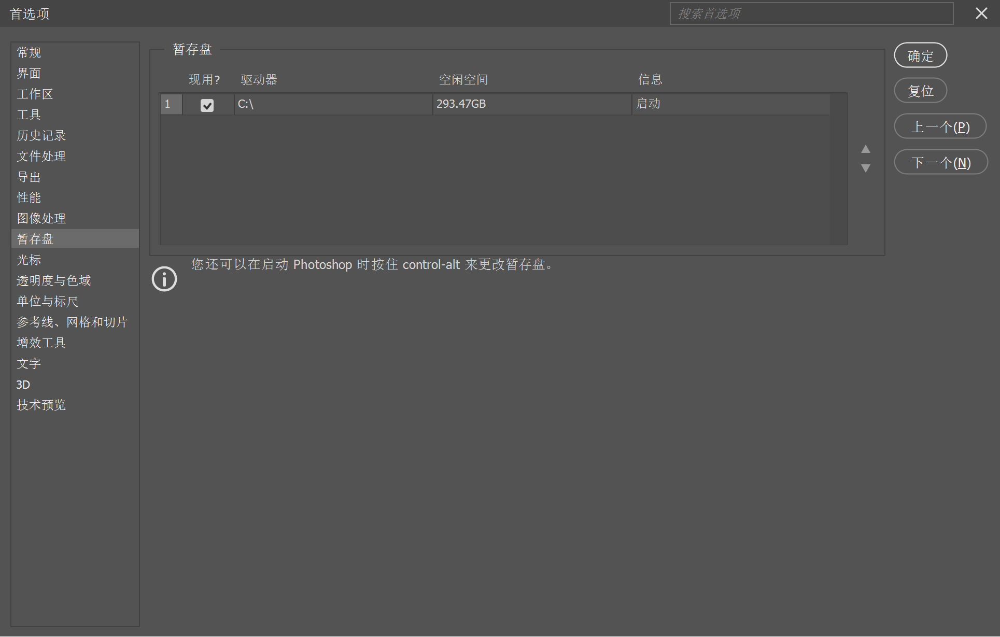

# 笔记

教程视频：
[【敬伟先生】敬伟PS教程全集 Photoshop从入门到精通](https://www.bilibili.com/video/BV1QY411P7E7/)

## A01基本概述

Photoshop（PS）：图像处理软件
	Adobe公司

广告海报 / 平面设计
产品设计 / 包装设计
摄影辅助 / 照片管理
图像处理 / 图像美化
界面设计 / 图标设计
游戏美术 / 动漫插画
视觉创意 / 图像特效
流行娱乐 / 创意风潮
效果图后期调整
前期创意绘图

## A02 软件准备

略

## A03 认识界面

主界面：菜单栏、选项栏、工具栏、面板

自定义工具栏：编辑(E) → 工具栏...

信息栏：

滚动操作：
	垂直滚动：鼠标滚轮
	快速垂直滚动：Shift + 鼠标滚轮
	水平滚动：Ctrl + 鼠标滚轮
	快速水平滚动：Ctrl + Shift + 鼠标滚轮

缩放画面：Alt + 鼠标滚轮
快速缩放画面：Shift + Alt + 鼠标滚轮

恢复界面（工作区）：窗口(W) → 工作区(K) → 复位基本功能(R)

自定义界面（工作区）：窗口(W) → 工作区(K) → 新建工作区(N)...

查看界面（工作区）：

## A04 新建文档

新建文档：文件(F) → 新建(N)...
	快捷键：Ctrl + N

分辨率：
	单位：Ppi（Pixel Per Inch）
	72Ppi：1英寸由72个像素组成
	分辨率↑，像素↑，图像细节↑

颜色模式：

存储预设信息：

## A05 图像大小

修改画面大小：图像(I) → 图像大小(I)...
	快捷键：Ctrl + Alt + I

总像素值 = 宽度像素值 × 高度像素值
	= 宽(英寸) × 高(英寸) × 分辨率(像素/英寸) 2

## A06 存储文件

打开文件：文件(F) → 打开(O)...
	快捷键：Ctrl + O

保存文件：文件(F) → 存储(S)
	快捷键：Ctrl + S

存储为：文件(F) → 存储为(A)...
	快捷键：Ctrl + Shift + S

关闭文件：文件(F) → 关闭(C)
	快捷键：Ctrl + W

关闭全部文件：
	快捷键：Ctrl + Alt + W

## A07 性能配置

首选项：编辑(E) → 首选项(N)
	快捷键：Ctrl + K

暂存盘：存放大量临时数据

历史记录：50 → 500

自动保存：10分钟 → 5分钟

快捷键设置：编辑(E) → 键盘快捷键...
	快捷键：Ctrl + Shift + Alt + K

## A08 图层知识

空白图层 = 透明胶片

打开图层面板：窗口(W) → 图层
	快捷键：F7

图层类型：
	普通图层
	背景图层
	智能对象图层
	调整图层
	填充图层
	视频图层
	矢量图层
	3D图层
	文字图层
	······

新建普通图层：图层(L) → 新建(N) → 图层(L)...
	快捷键：Shift + Ctrl + N
	快捷方式：点击图层面板的

选择多个图层：Ctrl + 点击图层
选择连续图层：Shift + 点击图层

打开/关闭图层：点击图层的

打开/关闭目标图层以外的图层：Alt + 点击图层的

向下移动图层：Ctrl + [
向上移动图层：Ctrl + ]

复制图层：图层(L) → 复制图层(D)...
	快捷键1：Alt + 拖拽图层
	快捷键2：Ctrl + J
	快捷方式：拖拽图层到图层面板的

复制多个图层：
	快捷键：Alt + 拖拽多个图层

删除图层：
	快捷键：Delete
	快捷方式1：点击图层面板的
	快捷方式2：拖拽图层到图层面板的

## A09 视图操作

视图缩放：
	信息栏输入百分比：

抓手工具：
	快捷键：空格
	几种缩放模式：

缩放工具：
	放大模式、缩小模式：
	细微缩放：
	取消细微缩放后，可以框选区域放大：

双击抓手工具：
双击缩放工具：

快捷键：
	放大：Ctrl + +
	缩小：Ctrl + -
	缩放画面：Alt + 鼠标滚轮
	快速缩放画面：Shift + Alt + 鼠标滚轮

打开导航器面板：窗口(W) → 导航器

旋转视图工具：长按抓手工具

	快捷键：R
	点击拖拽旋转

## A10 移动工具

